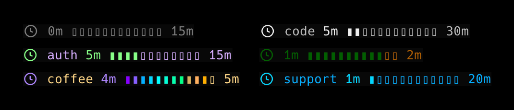

# tmux-timer

A timer plugin for tmux that renders in the status line.

Start a timer, keep it visible in the tmux status line, attach a short task label, and switch themes without leaving tmux.



## Overview

- Useful for Pomodoro sessions, work intervals, and ad hoc countdowns
- Controlled entirely from tmux key bindings
- Supports task labels and preset themes
- Can play a sound when a timer starts or finishes

## Features

- Status-line timer with elapsed time, total time, and visual progress
- Start, stop, and theme switching from tmux key bindings
- Optional inline task label
- Preset themes: `levander`, `spectrum`, `ocean`, `forest`, `mono`
- Remembers the last used duration
- Supports timers from `1` to `1440` minutes

## Install

With TPM:

```tmux
set -g @plugin 'martynasjocius/tmux-timer'
run '~/.tmux/plugins/tpm/tpm'
```

Manual load:

```tmux
run-shell ~/.tmux/plugins/tmux-timer/tmux-timer.tmux
```

## Usage

Default key bindings:

- `prefix + T`, then `s` to start a timer
- `prefix + T`, then `x` to stop the current timer
- `prefix + T`, then `t` to switch theme

Examples:

- `25`
- `25 task-x`
- `90 deep work`
- `10 break`

## Configuration

Default theme:

```tmux
set -g @tmux_timer_theme 'levander'
```

Available themes:

- `levander`
- `spectrum`
- `ocean`
- `forest`
- `mono`

Disable sounds:

```tmux
set -g @tmux_timer_sound_enabled '0'
```

## Notes

- The clock icon uses a Nerd Font glyph, so a Nerd Font-enabled terminal is recommended
- Theme changes can be made either in tmux config or from the `prefix + T`, then `t` prompt

## Development

From the repo root:

```bash
./tmux-timer.tmux
```

## Author

Created by Martynas Jocius.

## License

[MIT](./LICENSE)
